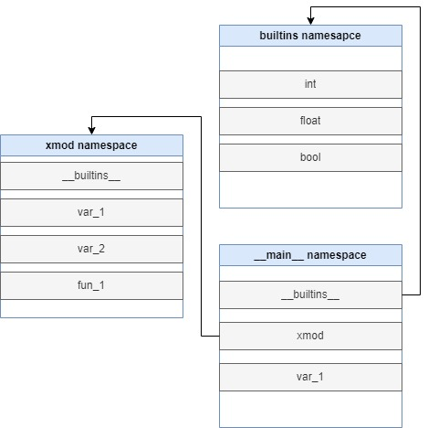

# Python

References:
- [docs.python.org](https://docs.python.org/3/)
- [realpython.com](https://realpython.com/)
- [www.w3schools.com](https://www.w3schools.com/python/)

## Chap 5. Classes

**Notes:**
- Classes provide a means of bundling data and functionality together.
- Creating a new class creates a new *type* of object, allowing new *instances* of that type to be made.
- Classes are created at runtime, and can be modified further after creation.
- In C++ terminology, normally class members are public, and all member functions are virtual.
- There are no shorthands for referencing the object’s members from its methods.
- Classes themselves are objects.
- Built-in types can be used as base classes for extension by the user.
- Most built-in operators with special syntax can be redefined for class instances.

### Python Scopes and Namespaces

- Objects have individuality, and multiple names (in multiple scopes) can be bound to the same object.

#### Namespaces

A **namespace** is a mapping from names to objects. Example:
- the set of built-in names
- the global names in a module (module's namespace)
- the local names in a function invocation
- In a sense the set of attributes of an object also form a namespace.

The module’s attributes and the global names defined in the module: they share the same namespace!  
Attributes may be read-only or writable.  
Namespaces are created at different moments and have different lifetimes.  

**xmod.py**
```python
var_1 = 1
var_2 = 2
def fun_1: pass
```
**test.py**
```python
import xmod
var_1 = "1"
```
**run**
```bash
python test.py
```
**Namespace when run**  
&emsp;

#### Scopes

A **scope** is a textual region of a Python program where a namespace is directly accessible.  
At any time during execution, there are 3 or 4 nested scopes whose namespaces are directly accessible:
- the innermost scope, which is searched first, contains the local names
- the scopes of any enclosing functions, which are searched starting with the nearest enclosing scope, contain non-local, but also non-global names
- the next-to-last scope contains the current module’s global names
- the outermost scope (searched last) is the namespace containing built-in names

**Notes:**
- To rebind variables found outside of the innermost scope, the `nonlocal` statement can be used; if not declared `nonlocal`, those variables are read-only.
- A special quirk of Python is that – if no `global` or `nonlocal` statement is in effect – assignments to names always go into the innermost scope.
- Assignments do not copy data — they just bind names to objects. The same is true for deletions.
- All operations that introduce new names use the local scope.

#### `globals\locals` Built-in Function

- `globals()` Return the dictionary implementing the current module namespace.
- `locals()` Return a mapping object representing the current local symbol table. with variable names as the keys, and their currently bound references as the values.

> **Notes:** in function, each call to `locals()` instead returns a fresh dictionary containing the current bindings of the function’s local variables and any nonlocal cell references.


```python
%reset -f
# Example on globals()

ns = globals()
# print(f"{ns = }")

print(f"{"x" in ns = }")
x = 10

print(f"{"x" in ns = }")
print(f"{globals() is ns = }")

globals()["y"] = 20 # same as `y = 20`
print(f"{y = }")
```


```python
%reset -f
# Example on locals()

print(f"{locals() is globals() = }")
y = 2

def f():
    lc = locals()
    print(f"{lc = }")
    x = 1
    print(f"{lc = }")
    locals()
    print(f"{lc = }")
f()
```


#### `global` and `nonlocal` Statement

- The `global` statement can be used to indicate that particular variables live in the global scope and should be rebound there.
- The `nonlocal` statement indicates that particular variables live in an enclosing scope and should be rebound there.


```python
%reset -f
# Example

def scope_test():
    def do_local():
        def deeper():
            spam = "local spam"
            print("-"*10)
            print(f"do_local deeper: {locals()}")
        deeper()
        print(f"do_local: {locals()}")

    def do_nonlocal():
        def deeper():
            nonlocal spam
            spam = "nonlocal spam"
            print("-"*10)
            print(f"do_nonlocal deeper: {locals()}")
        deeper()
        print(f"do_nonlocal: {locals()}")

    def do_global():
        def deeper():
            global spam
            spam = "global spam"
            print("-"*10)
            print(f"do_global deeper: {locals()}")
        deeper()
        print(f"do_global: {locals()}")

    spam = "test spam"
    print("-"*10)
    print(f"scope_test: {locals()}")
    
    do_local()
    print("After local assignment:", spam)
    do_nonlocal()
    print("After nonlocal assignment:", spam)
    do_global()
    print("After global assignment:", spam)

scope_test()
print(10*"-")
print("In global scope:", spam)
```


```python
%reset -f
# Funny example

fake_int = int
int = None; del int

# print(int)
# print(type(fake_int))

print(f"{fake_int("101", 2) = }")
print(f"{fake_int.__name__ = }")

# fake_int.__name__ = "this not int" 
```


### A First Look at Classes

#### Class Definition Syntax

```python
class ClassName:
    <statement-1>
    .
    .
    .
    <statement-N>
```

- The statements inside a class definition will usually be function definitions, but other statements are allowed.
- The function definitions inside a class normally have a peculiar form of argument list, dictated by the calling conventions for methods.
- When a class definition is entered, a new namespace is created, and used as the local scope.
- When a class definition is left normally (via the end), a **class object** is created.


```python
%reset -f

class C:
    x = 10
    def f(s):
        print(s)
    f("This is in class")
    print(f"{locals() = }")

C()
print(f"{type(C  ) = }")
print(f"{type(int) = }")
# C.__name__ = "notC"
```


#### Class Objects

Class objects support two kinds of operations: 
- attribute references
- instantiation


```python
%reset -f

class MyClass:
    """A simple example class"""
    i = 12345

    def f(self):
        return 'hello world'

# Example on attribute references
print(f"{MyClass.i = }")
print(f"{MyClass.f = }")

# Example on instantiation
c = MyClass()
print(f"{type(c) = }")
```


**__init__()**

Many classes like to create objects with instances customized to a specific initial state. Therefore a class may define a special method named `__init__()`.


```python
%reset -f

class Complex:
    def __init__(self, realpart, imagpart):
        self.r = realpart
        self.i = imagpart

x = Complex(3.0, -4.5)
x.r, x.i

```


#### Instance Objects

- The only operations understood by instance objects are attribute references.
- There are two kinds of valid attribute names:
  - data attributes (instance variables/data members).
  - methods (a method is a function that “belongs to” an object).
- Data attributes need not be declared. Valid method names of an instance object depend on its class.


```python
x.counter = 1
while x.counter < 10:
    x.counter = x.counter * 2
print(x.counter)
del x.counter

```


#### Method Objects

**Method work:**  
When a non-data attribute of an instance is referenced, the instance’s class is searched. If the name denotes a valid class attribute that is a function object, references to both the instance object and the function object are packed into a method object. When the method object is called with an argument list, a new argument list is constructed from the instance object and the argument list, and the function object is called with this new argument list.

> **Notes:**
> - First argument in function for method should be named self.


```python
%reset -f
# Example

class MyClass:
    """A simple example class"""
    i = 12345

    def f(self):
        print('hello world')

x = MyClass()

print(f"{type(MyClass.f) = }")
print(f"{type(x.f) = }")

MyClass.f(x)
x.f()
```


#### Class and Instance Variables

Instance variables are for data unique to each instance and class variables are for attributes and methods shared by all instances of the class.


```python
%reset -f

class Dog:

    tricks = []             # mistaken use of a class variable

    def __init__(self, name):
        self.name = name

    def add_trick(self, trick):
        self.tricks.append(trick)

d = Dog('Fido')
e = Dog('Buddy')
d.add_trick('roll over')
e.add_trick('play dead')
d.tricks

```


#### Static method
 
- How? Using the `staticmethod` decorator


```python
%reset -f

class MyClass:
    @staticmethod
    def the_static_method(x):
        print(x)

obj = MyClass()
print(f"{dir(obj) = }")
obj.the_static_method("Hello World")
MyClass.the_static_method("Hello World")

```


> For more remark about python's class. Check [Random Remarks](https://docs.python.org/3/tutorial/classes.html#random-remarks).

### Inheritance

#### Basic on Inheritance

**Syntax:**
```python
class DerivedClassName(BaseClassName):
    <statement-1>
    .
    .
    .
    <statement-N>
```

```class DerivedClassName(modname.BaseClassName):``` also valid.

**Notes:**
- Execution of a derived class definition proceeds the same as for a base class. When the class object is constructed, the base class is remembered. This is used for resolving attribute references.
- There’s nothing special about instantiation of derived classes.
- Derived classes may override methods of their base classes (methods in Python are effectively virtual).
- An overriding method in a derived class may in fact want to extend rather than simply replace the base class method of the same name. `BaseClassName.methodname(self, arguments)`


```python
%reset -f

class Base:
    x = "Base"
    
    def f(self):
        print("In Base: ", self.x)

    def g(self):
        self.f()

class Derived(Base):
    x = "Derived"

    def f(self):
        print("In Derived: ", self.x)

obj = Derived()
obj.g()
Base.g(obj)
Base.f(obj)
print(f"{obj.x = }")
```


> Python has two built-in functions that work with inheritance:
> - Use `isinstance()` to check an instance’s type: `isinstance(obj, int)` will be `True` only if `obj.__class__` is `int` or some class derived from `int`.
> - Use `issubclass()` to check class inheritance: `issubclass(bool, int)` is `True` since `bool` is a subclass of `int`. However, `issubclass(float, int)` is `False` since `float` is not a subclass of `int`.
> *Syntax:*
> - isinstance(object, classinfo)
> - issubclass(class, classinfo)
> *classinfo* may be a tuple of class objects or a Union Type.

#### Multiple inheritance

**Syntax:**
```python
class DerivedClassName(Base1, Base2, Base3):
    <statement-1>
    .
    .
    .
    <statement-N>
```

**Notes:**
- The search for attributes inherited from a parent class as depth-first, left-to-right, not searching twice in the same class.
- In fact, it is slightly more complex than that; the method resolution order changes dynamically to support cooperative calls to `super()`.
- To keep the base classes from being accessed more than once, the dynamic algorithm linearizes the search order in a way that preserves the left-to-right ordering specified in each class, that calls each parent only once, and that is monotonic.

### Private Variables

- “Private” instance variables that cannot be accessed except from inside an object don’t exist in Python.
- However, there is a convention that is followed by most Python code: a name prefixed with an underscore (e.g. _spam) should be treated as a non-public part of the API (whether it is a function, a method or a data member).

### Iterators

**Example:**
```python
for element in [1, 2, 3]:
    print(element)
```

Behind the scenes:
- the `for` statement calls `iter()` on the container object to get itorator object.
- `__next__()` method will call by itorator to get element to assign to *var_list*.
- When there are no more elements, `__next__()` raises a `StopIteration` exception which tells the for loop to terminate.

> You can call the __next__() method using the next() built-in function.


```python
%reset -f

s = [1, 2, 3]
it = iter(s)
print(it)
print(f"{next(it) = }")
print(f"{next(it) = }")
print(f"{next(it) = }")

# list() also use itorator
it = iter(s)
print(f"{next(it) = }")
print(f"{list(it) = }")
```


```python
%reset -f

class Reverse:
    """Iterator for looping over a sequence backwards."""
    def __init__(self, data):
        self.data = data
        self.index = len(data)

    def __iter__(self):
        return self

    def __next__(self):
        if self.index == 0:
            raise StopIteration
        self.index = self.index - 1
        return self.data[self.index]

rev = Reverse('spam')
print(f"{iter(rev) = }")

for char in rev:
    print(char)
```


### Generators

**Generators** are a simple and powerful tool for creating iterators. They are written like regular functions but use the `yield` statement whenever they want to return data.


```python
%reset -f
count = 0

def name():
    global count
    
    c = "E"
    count += 1
    yield c
    
    c = "C"
    count += 1
    yield c
    
    c = "S"
    count += 1
    yield c

it = name()
print(f"{type(it) = }")

print(f"{list(it) = }")
print(f"{count = }")

# next(it)

def reverse(data):
    for index in range(len(data)-1, -1, -1):
        yield data[index]

for char in reverse('golf'):
    print(char, end='')
```


### Generator Expressions

- Some simple generators can be coded succinctly as expressions using a syntax similar to list comprehensions but with parentheses instead of square brackets.
- These expressions are designed for situations where the generator is used right away by an enclosing function.
- Generator expressions are more compact but less versatile than full generator definitions and tend to be more memory friendly than equivalent list comprehensions.


```python
%reset -f

s = sum(i*i for i in range(10) if i % 3 != 0)
print(f"{s = }")

ge = (i*i for i in range(10) if i % 3 != 1)
print(f"{type(ge) = }")
for i in ge:
    print(i)
```


### Overloading Operators and Built-in Function

Python class provide special method for user to overloading. Some of them:
- `__str__()`
- `__len__()`
- `__iter__()`
- `__next__()`
- `__abs__()`  
...
- `__lt__()`
- `__le__()`
- `__eq__()`
- `__ne__()`
- `__ge__()`
- `__gt__()`  
...  
- `__bool__()`

For special method for overloading some built-in function, see [here](https://docs.python.org/3/library/functions.html).
For special method for overloading some operator, see [here](https://docs.python.org/3/library/operator.html#in-place-operators).


```python
%reset -f

class Z65537:
    p = 65537
    def __init__(self, value):
        self.val = value

    def __str__(self):
        return str(self.val)

    def __repr__(self):
        return str(self.val)

    def __bool__(self):
        return self.val

    def __add__(self, other):
        if isinstance(other, Z65537):
            return Z65537((self.val + other.val) % self.p)
        elif isinstance(other, int):
            return Z65537((self.val + other) % self.p)
        else:
            raise Exception("Invalid Number")

    def __neg__(self):
        return Z65537(p - self.val)
    
    def __sub__(self, other):
        return self.__add__(self.__neg__())

    def __mul__(self, other):
        if isinstance(other, Z65537):
            return Z65537((self.val*other.val) % self.p)
        elif isinstance(other, int):
            return Z65537((self.val*other) % self.p)
        else:
            raise Exception("Invalid Number")

    def __truediv__(self, other):
        if isinstance(other, Z65537):
            return Z65537((self.val*pow(other.val, - 1, self.p)) % self.p)
        elif isinstance(other, int):
            return Z65537((self.val*pow(other, - 1, self.p)) % self.p)
        else:
            raise Exception("Invalid Number")

    def __abs__(self):
        return Z65537(min(self.p - self.val, self.val))

a = Z65537(1337)
z1 = Z65537(1)
z0 = Z65537(0)
print(f"{a = }")
inv_a = z1 / a
print(f"{inv_a = }")
print(f"{abs(inv_a) = }")
# print 
```
